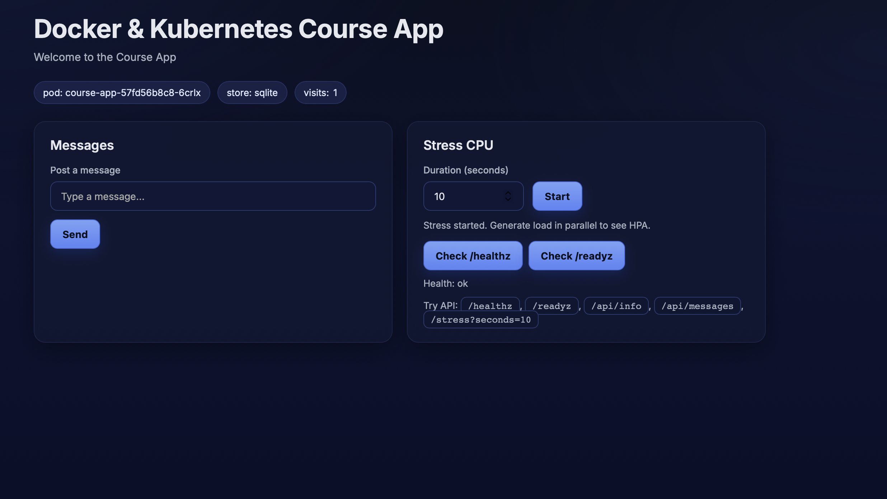

# homework-lesson-06-Yevhen-Marholin

## 1. Push image у Docker Hub

Було зібрано Docker image для `apps/course-app`.

```bash
docker build -t course-app .

docker build -t course-app .
[+] Building 16.7s (11/11) FINISHED                                                                    docker:default
 => [internal] load build definition from Dockerfile                                                             0.0s
 => => transferring dockerfile: 247B                                                                             0.0s
 => [internal] load metadata for docker.io/library/python:3.12-alpine                                            1.2s
 => [auth] library/python:pull token for registry-1.docker.io                                                    0.0s
 => [internal] load .dockerignore                                                                                0.0s
 => => transferring context: 2B                                                                                  0.0s
 => [1/5] FROM docker.io/library/python:3.12-alpine@sha256:236173eb74001afe2f60862de935b74fcbd00adfca247b2c2705  1.1s
 => => resolve docker.io/library/python:3.12-alpine@sha256:236173eb74001afe2f60862de935b74fcbd00adfca247b2c2705  0.0s
 => => sha256:3a4f2e6e1560fccb75f8aa9c6b7458b3179164f6378b125e533286c88351cd2a 250B / 250B                       0.1s
 => => sha256:fd21a26fb55d22baaa317c98a4296e6a284dd39cc0f9e68ef781bb74adfd6dc7 13.74MB / 13.74MB                 0.4s
 => => sha256:254ac41e2afd13e7a1276627191463329b96d835eab35e7804fdad56d7e363d5 0B / 455.66kB                    15.4s
 => => sha256:6a0ac1617861a677b045b7ff88545213ec31c0ff08763195a70a4a5adda577bb 3.86MB / 3.86MB                   0.4s
 => => extracting sha256:6a0ac1617861a677b045b7ff88545213ec31c0ff08763195a70a4a5adda577bb                        0.1s
 => => extracting sha256:254ac41e2afd13e7a1276627191463329b96d835eab35e7804fdad56d7e363d5                        0.1s
 => => extracting sha256:fd21a26fb55d22baaa317c98a4296e6a284dd39cc0f9e68ef781bb74adfd6dc7                        0.4s
 => => extracting sha256:3a4f2e6e1560fccb75f8aa9c6b7458b3179164f6378b125e533286c88351cd2a                        0.0s
 => [internal] load build context                                                                                0.0s
 => => transferring context: 26.80kB                                                                             0.0s
 => [2/5] WORKDIR /src                                                                                           0.5s
 => [3/5] COPY requirements.txt .                                                                                0.0s
 => [4/5] RUN pip install --no-cache-dir -r requirements.txt                                                    10.0s
 => [5/5] COPY . .                                                                                               0.1s
 => exporting to image                                                                                           3.7s
 => => exporting layers                                                                                          2.8s
 => => exporting manifest sha256:fc89aad28a43e8e15e9fdf86eaa1bd765598fe41b6ed7cd486b7bf940e56425c                0.0s
 => => exporting config sha256:00caa38519ced92bf3c5d0043db7ba04c3975dc2191d621fcca6d276b5b68b9f                  0.0s
 => => exporting attestation manifest sha256:289fd5aa20a9244ec5960289d7f0bb231a60a680f610aa98029550fa5630c920    0.0s
 => => exporting manifest list sha256:c239f62a8273363a331c8546c135abc2a1471e55290f63a75ee1ac16874de8d6           0.0s
 => => naming to docker.io/library/course-app:latest                                                             0.0s
 => => unpacking to docker.io/library/course-app:latest     
```

Образ було затеговано для Docker Hub:

```bash
docker tag course-app djmen12/course-app:latest
```

Образ було завантажено у Docker Hub:

```bash

@YevhenMarholin ➜ /workspaces/homework-lesson-06-Yevhen-Marholin/apps/course-app (main) $ docker push djmen12/course-app:latest
The push refers to repository [docker.io/djmen12/course-app]
fd21a26fb55d: Pushed 
3a4f2e6e1560: Pushed 
6a0ac1617861: Pushed 
d6f7fe025f9e: Pushed 
f8441933c847: Pushed 
42319ef88c1c: Pushed 
254ac41e2afd: Pushed 
afccade3abdd: Pushed 
cae1a822b5f5: Pushed 
latest: digest: sha256:c239f62a8273363a331c8546c135abc2a1471e55290f63a75ee1ac16874de8d6 size: 856


```

---

## 2. Deployment manifest

Було створено файл `deployment.yaml`.

```yaml
apiVersion: apps/v1
kind: Deployment
metadata:
  name: course-app
spec:
  replicas: 2
  selector:
    matchLabels:
      app: course-app
  template:
    metadata:
      labels:
        app: course-app
    spec:
      containers:
        - name: course-app
          image: djmen12/course-app:latest
          imagePullPolicy: Always
          ports:
            - containerPort: 8080
          env:
            - name: APP_STORE
              value: file
```

---

## 3. Service manifest

Було створено файл `service.yaml`.

```yaml
apiVersion: v1
kind: Service
metadata:
  name: course-app-service
spec:
  type: NodePort
  selector:
    app: course-app
  ports:
    - protocol: TCP
      port: 8080
      targetPort: 8080
      nodePort: 30080
```

## 4. Deploy у Kubernetes cluster

```bash
kubectl apply -f deployment.yaml
kubectl apply -f service.yaml
deployment.apps/course-app created
service/course-app-service created
```

Перевірка ресурсів:

```bash
kubectl get pods
kubectl get deployments
kubectl get services

AME                          READY   STATUS    RESTARTS   AGE
course-app-57fd56b8c8-6crlx   1/1     Running   0          9s
course-app-57fd56b8c8-wkxbs   1/1     Running   0          9s
NAME         READY   UP-TO-DATE   AVAILABLE   AGE
course-app   2/2     2            2           9s
NAME                 TYPE        CLUSTER-IP    EXTERNAL-IP   PORT(S)          AGE
course-app-service   NodePort    10.96.32.98   <none>        8080:30080/TCP   9s
kubernetes           ClusterIP   10.96.0.1     <none>        443/TCP          3m6s
```

---

## 5. Перевірка застосунку

Service має тип `NodePort`, тому застосунок доступний на порту `30080`.

```bash
curl http://localhost:30080
curl http://localhost:30080/healthz
```

Або у браузері:

```text
http://localhost:30080
http://localhost:30080/healthz

kubectl port-forward service/course-app-service 8080:8080
Forwarding from 127.0.0.1:8080 -> 8080
Forwarding from [::1]:8080 -> 8080
Handling connection for 8080
Handling connection for 8080
Handling connection for 8080
Handling connection for 8080
Handling connection for 8080
```

---

## 7. Зміна кількості реплік

У файлі `deployment.yaml` було змінено кількість реплік:

```yaml
replicas: 3
```

Після цього deployment було застосовано повторно:

```bash
kubectl apply -f deployment.yaml
deployment.apps/course-app configured
```

Перевірка процесу оновлення:

```bash
kubectl rollout status deployment/course-app
deployment "course-app" successfully rolled out
```

Перевірка pod-ів:

```bash
kubectl get pods

NAME                          READY   STATUS    RESTARTS   AGE
course-app-57fd56b8c8-6crlx   1/1     Running   0          3m59s
course-app-57fd56b8c8-wkxbs   1/1     Running   0          3m59s
course-app-57fd56b8c8-wnbqz   1/1     Running   0          13s
```

---

## Висновок

У межах домашнього завдання було:

- зібрано Docker image для `apps/course-app`
- завантажено image у Docker Hub
- описано Kubernetes `Deployment`
- описано Kubernetes `Service` з типом `NodePort`
- задеплоєно ресурси у Rancher Desktop Kubernetes cluster
- змінено кількість реплік у `deployment.yaml`
- перевірено процес оновлення через `kubectl rollout status deployment/course-app`